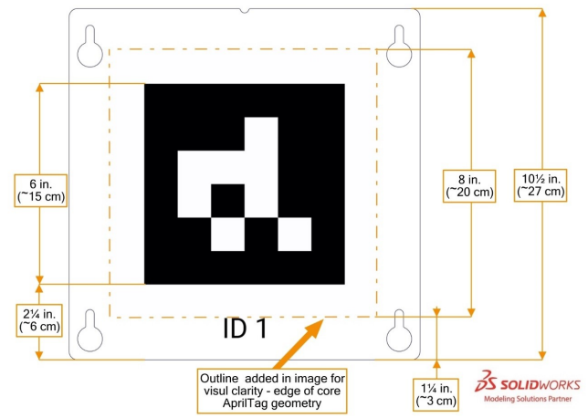

# Valor 6800 - Software Abstract

## Coordinate Frames

A coordinate frame is a reference system that establishes the orientation of an observed object in space. This is important to talk about up-front as various software mechanisms will deal with different coordinate frames.

### Camera Coordinate Frame

This coordinate frame is from the perspective of the camera. All coordinates should be in pixels
* X+ - Pointing to the right of the target if looking at the target
* Y+ - Pointing down
* Z+ - Pointing at the target

### Robot Coordinate Frame

This coordinate frame is from the perspective of the robot. All coordinates should be in meters.
* X+ - Pointing forward
* Y+ - Pointing toward the robot's right
* Z+ - Pointing upward

### Field Coordinate Frame

This coordinate frame is from the perspective of the field. All coordinates should be in meters.

The following table describes where the origin of the coordinate frame is depending on the alliance station the driver is in:

| Alliance | Origin |
| --- | --- |
| Blue | When standing in the blue driver station and looking across the field to the red driver station, the origin of the field is in bottom right corner of the field where the blue driver station wall meets the right field barrier. |
| Red | When standing in the red driver station and looking across the field to the blue driver station, the origin of the field is in bottom right corner of the field where the single substation meets the double substation |

A field is approximately 8.02 meters by 16.54 meters. Because the field is mirrored over the field centerline, the coordinate frame needs to be converted between the red and blue sides of the field.

To transfer coordinates between the blue side of the field (ground truth) and the red side of the field:

$(x_{red},y_{red},z_{red}) = (x_{blue},8.0-y_{blue},z_{blue})$

## AprilTag Coordinates

The AprilTags on the field need to be placed within the existing field coordinate frame.

The game manual provides the following mapping of AprilTags when in the Blue Alliance field coordinate frame:

| ID | X | Y | Z | Z-rotation |
| --- | --- | --- | --- | --- |
| 1 | 15.513558m | 1.071626m | 0.462788m | 180 |
| 2 | 15.513558m | 2.748026m | 0.462788m | 180 |
| 3 | 15.513558m | 4.424426m | 0.462788m | 180 |
| 4 | 16.178784m | 6.749796m | 0.695452m | 180 |
| 5 | 0.36195m | 6.749796m | 0.695452m | 0 |
| 6 | 1.02743m | 4.424426m | 0.462788m | 0 |
| 7 | 1.02743m | 2.748026m | 0.462788m | 0 |
| 8 | 1.02743m | 1.071626m | 0.462788m | 0 |

In order to synchronize each AprilTag with its' corresponding driver station, we need to convert the AprilTags that belong on the red side of the field to the Red Alliance field coordinate frame. The table below is each AprilTag in the appropriate coordinate frames:

| Coord. Frame | ID | X | Y | Z |
| --- | --- | --- | --- | --- |
| Red | 1 | 1.02743m | 6.928374m | 0.462788m |
| Red | 2 | 1.02743m | 5.251974m | 0.462788m |
| Red | 3 | 1.02743m | 3.575574m | 0.462788m |
| Red | 4 | 0.36195m | 1.250204m | 0.695452m |
| Blue | 5 | 0.36195m | 6.749796m | 0.695452m |
| Blue | 6 | 1.02743m | 4.424426m | 0.462788m |
| Blue | 7 | 1.02743m | 2.748026m | 0.462788m |
| Blue | 8 | 1.02743m | 1.071626m | 0.462788m |

The table is constructed by taking the red AprilTags (which need to be converted to the Red coordinate frame) and feeding them through the formula devised above:

$(x_{red},y_{red},z_{red}) = (x_{red},8.02-y_{blue},z_{red})$

## AprilTag Metadata

We will define some variables as:

${target}_{width} = 0.1524$

${target}_{height} = {target}_{width} = 0.1524$

## Localizing with AprilTags

Regardless of which vision library to use, there are a few pre-requisites in order to localize with AprilTags:

* The camera will need to see an AprilTag target in the Camera coordinate space
* The camera will need to convert the target from the Camera coordinate space, into a robot coordinate space, and send to the robot
* The robot will need to convert the robot coordinate space into field coordinate space to do any automated driving sequences.

Therefore there are 2 solutions that need to be worked out as the first pre-requisite is handled for us by COTs components:
1. Camera off-board processor needs to convert camera to robot coordinate space
2. Robot processor needs to convert robot to field coordinate space.

### Conversion: Camera -> Robot Coordinate Space

### Conversion: Robot -> Field Coordinate Space

In the past, Valor has utilized the [SwerveDriveOdometry](https://github.wpilib.org/allwpilib/docs/release/cpp/classfrc_1_1_swerve_drive_odometry.html) class to keep track of the robot's pose throughout the match. Odometry fuses the Pigeon IMU's gyroscope/accelerometer data with the Swerve Module's azimuth and drive encoder values. 

For higher resolution localization, we need to integrate vision with the existing sensors. Therefore WPI has provided a [SwerveDrivePoseEstimator](https://github.wpilib.org/allwpilib/docs/release/cpp/classfrc_1_1_swerve_drive_pose_estimator.html) class which combines vision with the existing Odometry. This should be a SIGNIFICANT improvement in accuracy of our localization.

All we need to do is pass in the vision objects into the SwerveDrivePoseEstimator (along with swerve information) and the library should localize and figure out what our field coordinate space looks like.

This works EXCEPT when the robot reboots on the field, or we don't put the robot in the proper startup location when starting things up. In this case, we need a method to take vision information and override the pose estimator.

## AprilTag Vision Tuning

We have 2 options for vision: Limelight and PhotonVision. The following guides discuss tuning options for both options.

### Limelight Tuning

The following table is a guide for Valor students to begin [tuning AprilTag vision with Limelight](https://docs.limelightvision.io/en/latest/apriltags_in_2d.html#quick-start-for-frc):

### PhotonVision Tuning

The following table is a guide for Valor students to begin [tuning AprilTag vision within PhotonVision](https://docs.photonvision.org/en/latest/docs/getting-started/pipeline-tuning/apriltag-tuning.html):

| Tuning Parameter | Description | Recommended from PhotonVision | Valor suggestion |
| --- | --- | --- | --- |
| Target Family | AprilTag family | `16h5` | `16h5` |
| Decimate | Down-sampling. Increasing decimate increases detection rate while decreasing detection distance | 0 | More than 0. Detection distance needs to be within the community and that is it - need faster detection rate.
| Blur | More blur is needed if image is extremely noisy | 0 | 0. Image shouldn't be noisy. Can add rubber standoffs for vibration reduction if needed |
| Threads | Recommended that users stick to one less than the amount of CPU threads that your coprocessor has | 1 | 3. Limelight has 4 cores |
| Refine Edges | It is recommended to use this in tandem with decimate as it can increase the quality of the initial estimate. | 0 | More than 0, matching decimate |
| Pose Iterations | A smaller number between 0-100 is recommended. A smaller amount of iterations cause a more noisy set of poses when looking at the tag straight on, while higher values much more consistently stick to a (potentially wrong) pair of poses. | ??? | 50. Can filter in code if we need less noise |